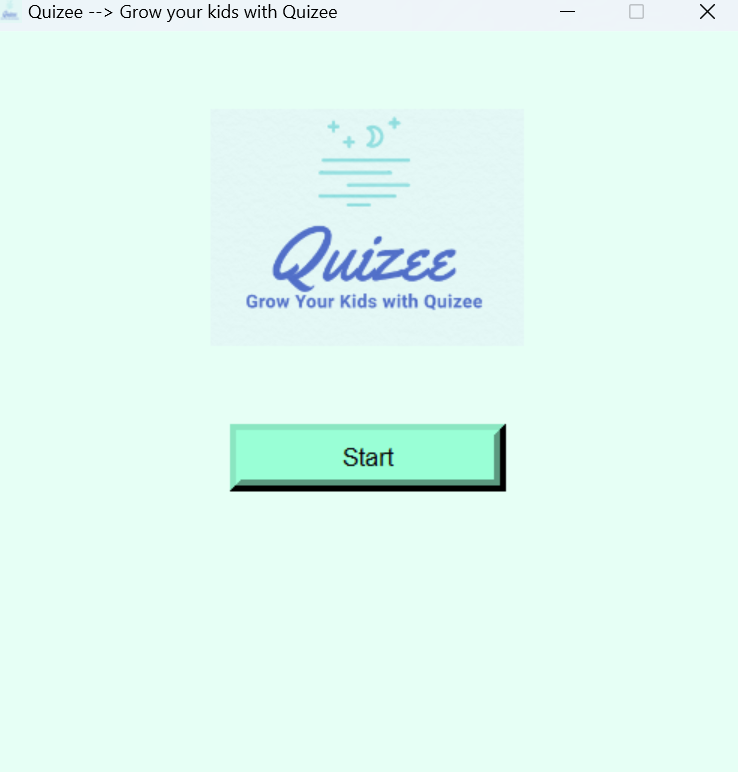
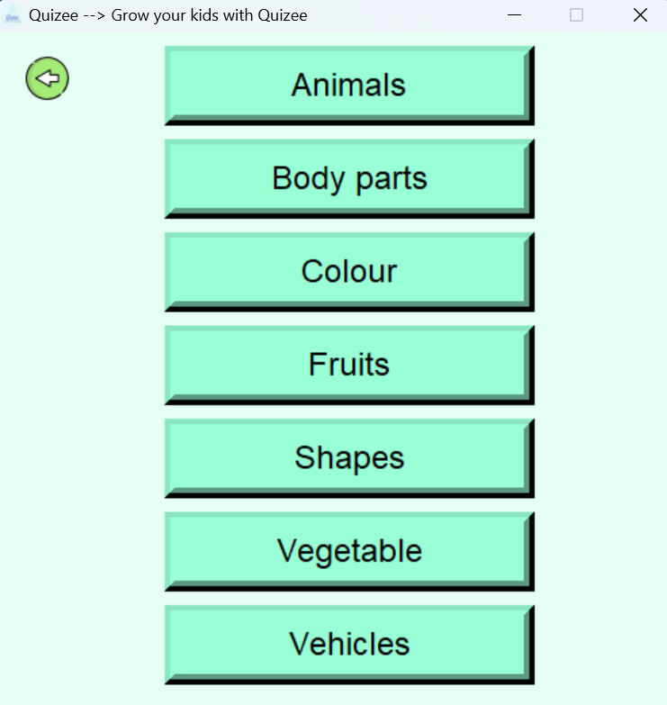
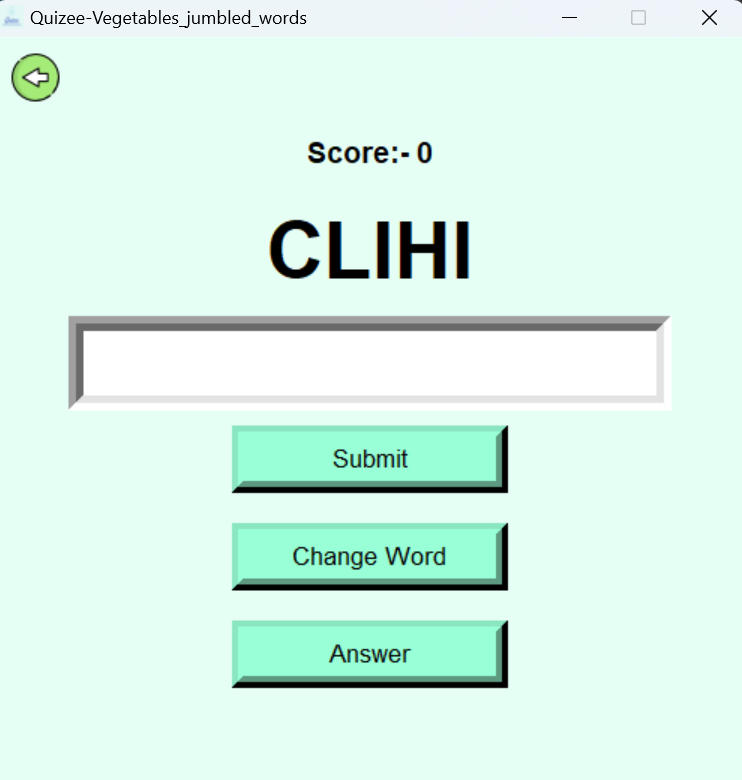
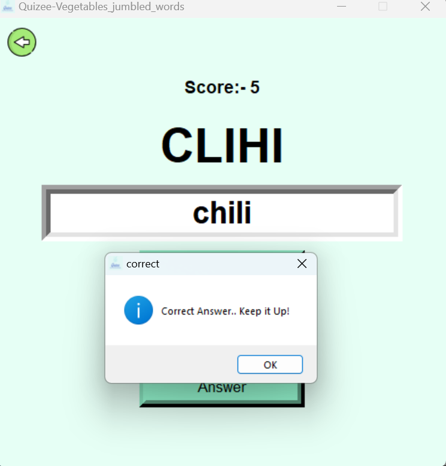

# Quiz Game
## Available for both CLI and GUI mode
## Installation :
git clone https://github.com/R3DHULK/quiz
## For CLI 
double click to quiz.exe for windows
##
compile quiz.c for linux
## For GUI 
double click on main_start.exe
# CLI Output :

# GUI Output :
## Starting page

## Options 

## Game 

## Success
